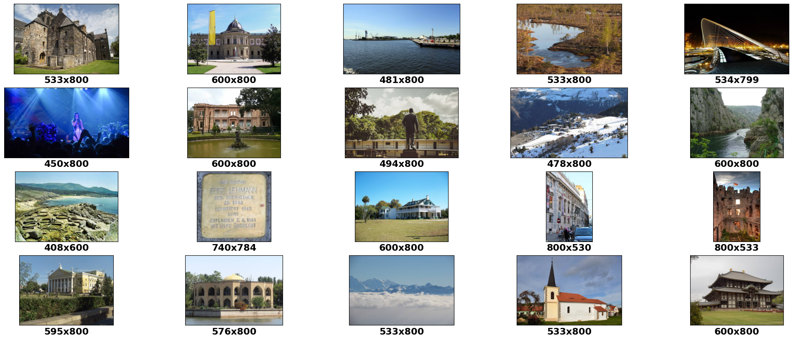
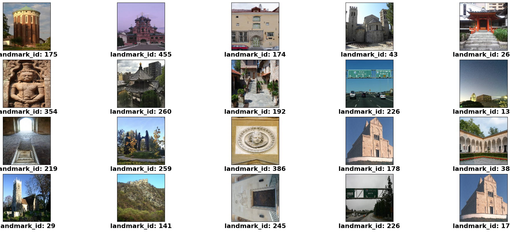
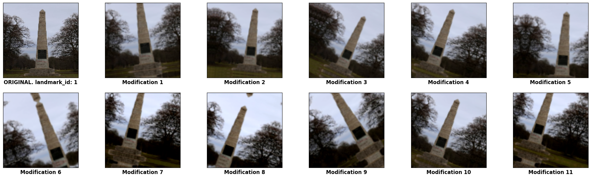
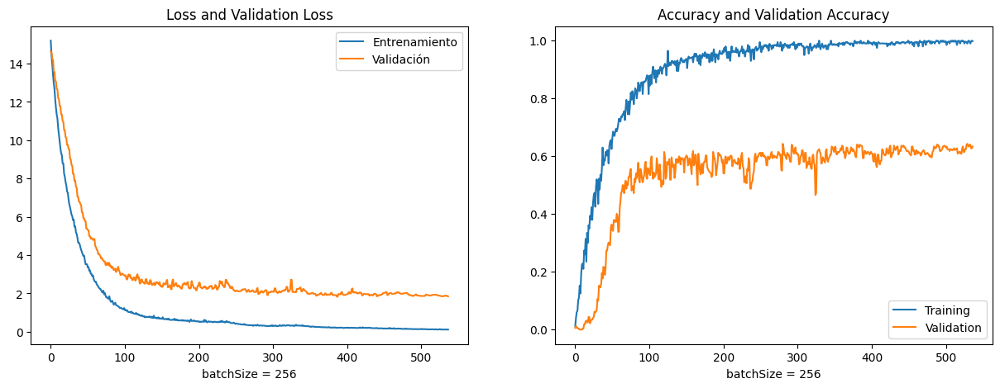
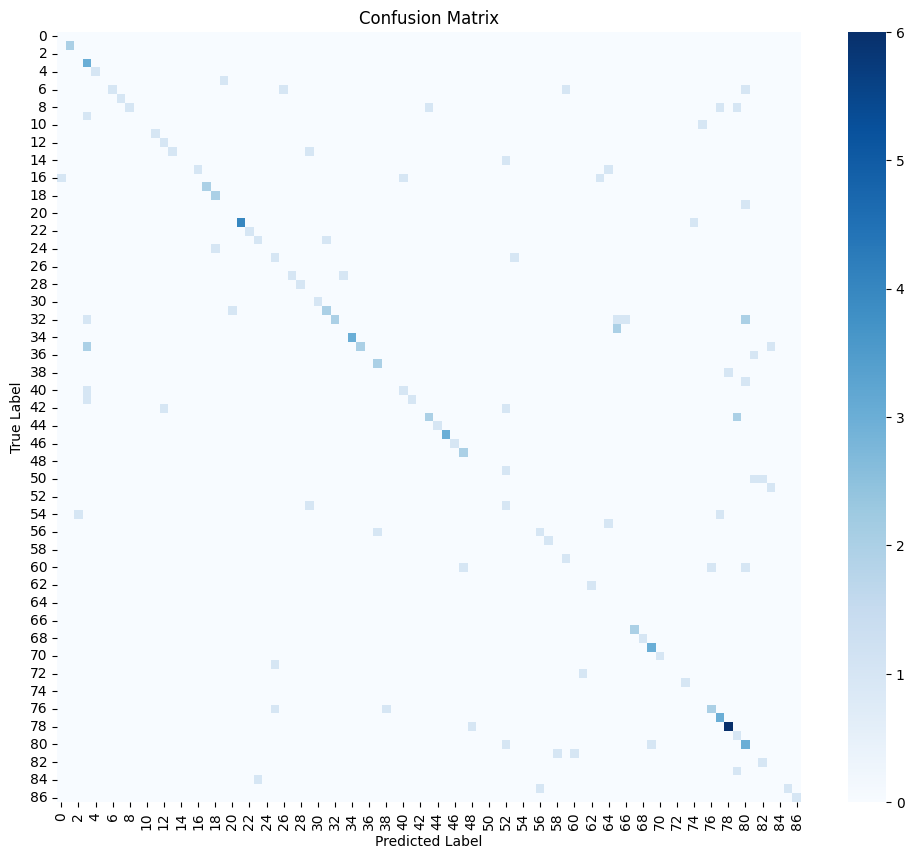
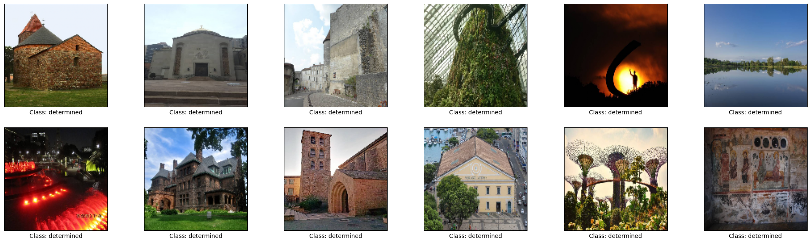
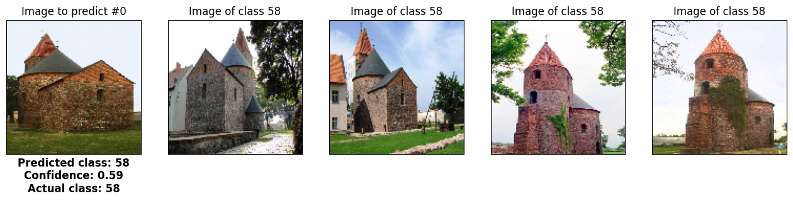

# Landmark Recognition Using Deep Learning

## Project Overview

This project implements a landmark recognition system using a Convolutional Neural Network (CNN) developed with TensorFlow and Keras. The objective is to classify images of landmarks from the Google Landmark Recognition 2021 dataset. The project demonstrates the complete deep learning workflow, including data preprocessing, data augmentation, model training, evaluation, and landmark prediction.

---

## Dataset

**Dataset:** Google Landmark Recognition 2021

The dataset contains images of landmarks collected from various locations around the world. Each image is associated with a landmark ID representing its class.

Dataset features:
- Landmark images
- Landmark ID labels
- Large number of landmark categories

For efficient training, a subset of landmark classes was selected and balanced using undersampling and oversampling techniques.

---

## Dataset Samples



---

## Sampled Dataset

After selecting landmark classes and applying undersampling.



---

## Data Preprocessing

The following preprocessing steps were performed before training:

- Loaded the Google Landmark Recognition dataset.
- Generated image paths automatically.
- Resized all images to **128 × 128** pixels.
- Normalized pixel values to the range **[0,1]**.
- Encoded landmark labels using **LabelEncoder**.
- Split the dataset into:
  - Training Set
  - Validation Set
  - Test Set
- Applied undersampling to reduce class imbalance.
- Applied oversampling for minority classes.
- Computed class weights for balanced learning.

---

## Data Augmentation

To improve model generalization, reduce overfitting and improve model robustness, the following augmentation techniques were used:

- Random Zoom
- Random Contrast
- Random Translation
- Random Rotation

Example augmented images are shown below.



---

## Model Architecture

A custom Convolutional Neural Network (CNN) was developed consisting of:

- 5 Convolutional Layers
- Batch Normalization
- Max Pooling
- Fully Connected Dense Layer
- Dropout Layer
- Softmax Output Layer

### Training Configuration

- Optimizer: Stochastic Gradient Descent (SGD) with Momentum
- Loss Function: Sparse Categorical Crossentropy
- Metrics: Sparse Categorical Accuracy
- Batch Size: 256
- Image Size: 128 × 128

The following callbacks were used during training:

- EarlyStopping
- ReduceLROnPlateau
- ModelCheckpoint

---

## Model Training

The model was trained using the processed landmark dataset.

Training performance is shown below.



---

## Model Evaluation

The model was evaluated using:

- Training Accuracy
- Validation Accuracy
- Test Accuracy
- Training Loss
- Validation Loss
- Classification Report
- Confusion Matrix

### Confusion Matrix

The confusion matrix provides a visual representation of the model's classification performance across all landmark classes.



---

## Test Sample Images

Random images from the test dataset used for prediction.



---

## Prediction Results

The model predicts the landmark class for unseen images. The predicted class is displayed together with the confidence score, and example images from the predicted landmark class are shown for comparison.



---

## Challenges Faced

- The original dataset is very large and computationally expensive to train.
- Significant class imbalance required undersampling, oversampling, and class weighting.
- Preventing overfitting required data augmentation and regularization techniques.
- Training multiple landmark classes increased computation time.

---

## Future Improvements

Future enhancements include:

- Training on the complete Google Landmark Recognition dataset.
- Using Transfer Learning models such as ResNet50, EfficientNet, or MobileNetV2.
- Hyperparameter optimization.
- Deploying the model as a web application using Flask or FastAPI.
- Building a real-time landmark recognition system.

---

## Technologies Used

- Python
- TensorFlow
- Keras
- NumPy
- Pandas
- OpenCV
- Matplotlib
- Seaborn
- Scikit-learn

---

## Project Structure

```
Google-Landmark-Recognition/
│
├── images/
│   ├── dataset_samples.png
│   ├── sampled_dataset.png
│   ├── data_augmentation.png
│   ├── training_results.png
│   ├── confusion_matrix.png
│   ├── test_samples.png
│   └── prediction_results.png
│
├── landmark-recognition.ipynb
├── README.md
└── requirements.txt
```

---

## How to Run

Clone the repository.

```bash
git clone https://github.com/jamesalwin1/Google-Landmark-Recognition.git
```

Navigate to the project folder.

```bash
cd Google-Landmark-Recognition
```

Install the required packages.

```bash
pip install -r requirements.txt
```

---

## Running the Project

1. Download the Google Landmark Recognition 2021 dataset from Kaggle.
2. Place the dataset in the appropriate directory.
3. Open the notebook:

```bash
jupyter notebook
```

4. Run all notebook cells sequentially.
5. The notebook will:
   - Load and preprocess the dataset.
   - Train the CNN model.
   - Evaluate the model.
   - Generate prediction results and visualizations.

---


## Author

**James Alwin**

B.Tech Artificial Intelligence and Data Science
